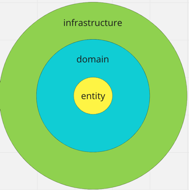

# Service
### Tools
- golang: 1.19
- goose: 3.5.3
- swagger: v0.30.3

### Dependencies
- postgres: 15
- kafka: 2.8.1
- zookeeper: 3.4.13

### Get started
1) Generate server and client

```
make generate-server-in-docker
make generate-client-in-docker
```

2) Build image build-service-image

```
make build-service-image
```

3) Build migrations image

```
make build-migration-image
```

4) Start service

```
make run-in-docker
```

Service will be ready on http://localhost:8000

To stop it run
```
make stop-in-docker
```

### Tests

1) Up tests environment 

```
make run-test-env-in-docker
```

2) Run tests

```
make run-test-in-docker
```

# About solution

### Decisions
1) For handling http requests I used go-swagger, because
- Go-swagger generates a lot of boilerplate code and speed up development
- Go-swagger generates code based on open API, consequently documentation always matches to code 
- I have experience of working with go-swagger

2) I chose postgres as database because
- I expected that in the future there will happen many-many relationships, e.g. users may be grouped. 
- Postgres requires strict on-write validation data scheme. It makes enterprise development more reliable. 
- Postgres supports full text search for implementing faceted search. I checked request for searching users with filters and was pretty fast (several ms on 5 million rows)

3) I used async notification and kafka because
- Async notification allows to connect new client for getting updates without improvements in user-manager
- Async notification decreases latency. 
- Kafka is high-performance, reliable and scalable tool. 

4) I wrote only functional tests
- In my opinion unit tests should check only difficult domain logic (e.g. crunching numbers). User-manager doesn't have such logic. It doesn't make sense to check mocked DB request. 
- Functional tests help QA engineer not to carry out regress test. 
- To track test coverage I need list with test cases. If every test case is covered with functional test I will have 100% functional test coverage. 

### Architecture

I implemented service with clean architecture. 



#### Infrastructure
Layer contains 
- Http handlers to handle incoming requests
- Producer to send async notifications to kafka 
- Repository to store data in postgres

We can change postgres to mysql or kafka to rabbitMQ easy and don't change domain logic.

#### Domain
Layer contains services for business logic implementation. This layer doesn't depend on infrastructure.

#### Entity
Layer contains 
- entity for server-repository communication
- models for handler-server communication

### Project structure
- `./api` contains open API specification
- `./build` contains configuration for building images and running containers
- `./cmd` is entry point for service
- `./config` contains structs for service configuration
- `./internal` - contains not imported internal logic
- `./migration` - sql migrations 
- `./pkg` - contains public logic which can be imported
- `./test` - contains functional tests
- `./tools` - internal tools for making service easier

# Improvements
1) Now if server gets error during producing event to kafka service will log error and event will be lost. Need to store such event to DB and implement cron to retry failed events. But should be careful with event order.
3) Pagination works until PO doesn't want to sort by created_at. That why I used id as UUID. I understand that is more secure, but if security teams allows it's better to change to int. Nevertheless I can add index (id, created_at) and get required result with UUID ID.
4) Add tools 
- prometheus for gathering metrics
- golangci-lint  
5) Setup logger with env variable to control output and log level
